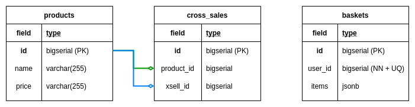

# eCommerce Cross-selling

## Goal

This repository is for the workshop on upgrading a Spring Boot 2 sample application to Spring Boot 3.


## Steps to Upgrade an Application to Spring Boot 3

* Upgrade to the Latest 2.7.x Version
* [Upgrade Spring Security 5.8](https://docs.spring.io/spring-security/reference/5.8/migration/index.html)
* Upgrade Java Version
* Review Deprecations from Spring Boot 2.x
* Upgrade to Spring Boot 3:
  * [Configuration Properties Migration](https://github.com/spring-projects/spring-boot/wiki/Spring-Boot-3.0-Migration-Guide#configuration-properties-migration)
  * [Check Spring Framework 6.0 changes](https://github.com/spring-projects/spring-framework/wiki/Upgrading-to-Spring-Framework-6.x)
  * Fix Import Statements


For more details, check: [Spring Boot 3.0 Migration Guide](https://github.com/spring-projects/spring-boot/wiki/Spring-Boot-3.0-Migration-Guide)


## How to Upgrade an Application to Spring Boot 3?

* Manual.
* Using [OpenRewrite recipes](https://docs.openrewrite.org/recipes/java/spring/boot3/upgradespringboot_3_0).
* With the [Spring Boot Migrator project](https://github.com/spring-projects-experimental/spring-boot-migrator).


## Given

#### 1. We have an eCommerce Rest API with the following endpoints:

- GET /api/products

- GET /api/products/{productId}

- GET /api/users/{userId}/basket

- POST /api/users/{userId}/basket

#### 2. When we enter the products page, the list of all products is returned to us:

- GET /api/products
```json
[
  {
    "id": 1,
    "name": "Dell Latitude 3301 Intel Core i7-8565U/8GB/512GB SSD/13.3",
    "price": "999,00 €"
  },
  {
    "id": 2,
    "name": "Samsonite Airglow Laptop Sleeve 13.3",
    "price": "41,34 €"
  },
  {
    "id": 3,
    "name": "Logitech Wireless Mouse M185",
    "price": "10,78 €"
  },
  {
    "id": 4,
    "name": "Fellowes Mouse Pad Black",
    "price": "1,34 €"
  }
]
```

#### 3. When we obtain a product by its ID, the related products are returned next to it:

- GET /api/products/{productId}
```json
{
  "product": {
    "id": 1,
    "name": "Dell Latitude 3301 Intel Core i7-8565U/8GB/512GB SSD/13.3",
    "price": "999,00 €"
  },
  "cross_selling": [
    {
      "id": 2,
      "name": "Samsonite Airglow Laptop Sleeve 13.3",
      "price": "41,34 €"
    },
    {
      "id": 3,
      "name": "Logitech Wireless Mouse M185",
      "price": "10,78 €"
    }
  ]
}
```

#### 4. We can get a user's basket by their **ID**.

- GET /api/users/{userId}/basket
```json
{
  "id": 1,
  "userId": 1,
  "items": {
    "products": [
      {
        "id": 3,
        "name": "Logitech Wireless Mouse M185",
        "price": "10,78 €"
      }
    ]
  }
}
```

#### 5. If the customer does not have a basket with products, is returned `HttpStatus.NOT_FOUND`.

#### 6. We can add products to this basket with POST and the payload:

- POST /api/users/{userId}/basket
```json
{
  "id": 3,
  "name": "Logitech Wireless Mouse M185",
  "price": "10,78 €"
}
```

#### 8. When we add a product to a basket and the basket does not exist, it is created automatically and the product is added successfully.

#### 9. When we add a product, it already exists in the basket, it is not added.

### Use PostgreSQL to save the data.

#### 1. This is the database schema:



#### 2. Run PostgreSQL locally with Docker:
`docker run -d -e POSTGRES_USER=superuser -e POSTGRES_PASSWORD=supersecret -e POSTGRES_DB=ecommerce -p 5432:5432 postgres:14`

#### 3. Use native queries to manage cross-sell data.

#### 4. This is the example of the [table creations](src/main/resources/db/migration/V001__CREATE_TABLES.sql).